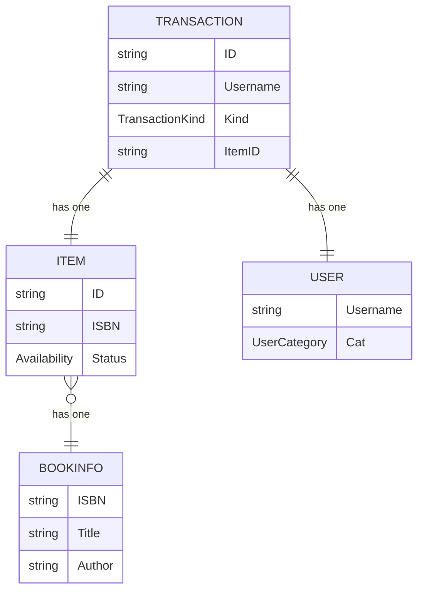

# Pustaka Console System
_"Your one stop solution for pus (library) system, now on the console!"_

## Usage

((work in progress))

## User Classification

### Pustakawan (administrator)

Abilities:
* Create, Read, Update, and Delete books from the book database
* Update total of the book item stock
* Create a borrowing/returning transaction

### Anggota (member)

Abilities:
* Create a borrowing/returning transaction

Abilities:
((work in progress))

## Diagram

